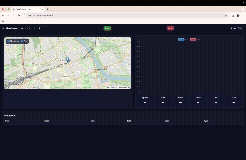

# FleetStream — Vehicle Telemetry Simulator & Dashboard

[](https://github.com/SculptTechProject/FleetStream/actions/workflows/ci-python.yml)
[](https://github.com/SculptTechProject/FleetStream/releases)
[](https://github.com/SculptTechProject/FleetStream/blob/main/LICENSE)
[](https://github.com/SculptTechProject/FleetStream/commits)

FastAPI + Kafka + (optional) Spark Structured Streaming.
One deterministic car emits realistic telemetry; a lightweight web dashboard shows live location, speed/RPM charts, heatmap, and a colored trail. You can start/stop the simulator from the UI and export CSV for analysis.

---

## Features

- **Simulator**: car state (Warsaw seed), road-type logic (urban/rural/highway), red lights, gear/RPM model, fuel, rare fault codes.
- **Kafka**: JSON events published to a topic (key = `vehicle_id`).
- **API**: start/stop/status, recent snapshots, violations, CSV export.
- **Dashboard** (`/dashboard`):
  - Live map (Leaflet) with **heatmap** (intensity ≈ speed; violations boost)
  - **Colored trail** by speed (green → blue → yellow → orange → red)
  - Speed/RPM mini chart, quick stats, **Start/Stop** buttons, **Export CSV**
- **Optional analytics**: Spark Structured Streaming consumer (Kafka source).

---

## Quick start

### With Docker

```bash
docker compose up -d --build
# API: http://localhost:8000
# UI:  http://localhost:8000/dashboard
```

### Local (Python)

```bash
python -m venv .venv && source .venv/bin/activate  # (or .venv\Scripts\activate on Windows)
pip install -r requirements.txt
# For websockets support use uvicorn extra or install a WS lib:
pip install "uvicorn[standard]" websockets
export KAFKA_BOOTSTRAP_SERVERS="localhost:9092"   # adjust as needed
uvicorn services.main:app --reload --port 8000
```

---

## Configuration

Environment variables:


| Name                      | Default                 | Description                |
| ------------------------- | ----------------------- | -------------------------- |
| `VEHICLE_ID`              | `TESTCAR01`             | Car identifier (Kafka key) |
| `KAFKA_BOOTSTRAP_SERVERS` | `localhost:9092`        | Kafka bootstrap servers    |
| `KAFKA_TOPIC`             | `vehicle.telemetry.raw` | Topic for raw telemetry    |

---

## REST & WS API

Base URL: `http://localhost:8000`

### Simulator control

```bash
# Start at 5 Hz
curl -X POST "http://localhost:8000/start-sim?rate_hz=5"

# Stop
curl -X POST "http://localhost:8000/stop-sim"

# Status
curl "http://localhost:8000/status"
```

### Telemetry

```bash
# Latest point
curl "http://localhost:8000/telemetry/latest"

# Recent N points (default 100, cap 2000)
curl "http://localhost:8000/telemetry/recent?limit=500"

# Recent violations (speeding / over redline)
curl "http://localhost:8000/telemetry/violations?limit=50"

# Export CSV
curl -L -o telemetry.csv "http://localhost:8000/telemetry/export.csv?limit=2000"
```

### WebSocket

- Endpoint: `ws://localhost:8000/ws`
- Messages:
  - `{"type":"snapshot","items":[ /* latest */ ]}`
  - `{"type":"event","data": { /* single telemetry event */ }}`

> If you see `Unsupported upgrade request` in logs, install WS support:
> `pip install "uvicorn[standard]" websockets` and restart the server.

---

## Dashboard

Open **`http://localhost:8000/dashboard`**.

- **Start / Stop** buttons call the API.
- **Rate (Hz)** controls simulator emission frequency.
- **Trail** toggle shows the colored path; **Heatmap** toggle shows density (weighted by speed, violations highlighted).
- **Export CSV** downloads recent events for analysis.



---

## Kafka

- Topic: `${KAFKA_TOPIC}` (default `vehicle.telemetry.raw`)
- Key: `vehicle_id` (`TESTCAR01` by default)
- Value: JSON, example:

```json
{
  "vehicle_id": "TESTCAR01",
  "timestamp": "2025-08-09T12:34:56.789012+00:00",
  "location": { "lat": 52.2304, "lon": 21.0122 },
  "speed_kmh": 73.4,
  "engine_rpm": 2140,
  "gear": 4,
  "fuel_level_pct": 92.1,
  "fault_codes": [],
  "road_type": "urban",
  "speed_limit_kmh": 50,
  "speeding": true,
  "rpm_over_redline": false
}
```

> Fields like `road_type`, `speed_limit_kmh`, `speeding`, `rpm_over_redline` are included in the live API/feed for convenience (derivable on the consumer side as well).

---

## Spark Structured Streaming (optional)

Example approach (Kafka → aggregation → sink):

```python
# See processing/stream_agg.py for a reference:
# - reads Kafka 'vehicle.telemetry.raw'
# - parses JSON schema
# - aggregates avg speed in 1-min windows
# - writes to memory/table or parquet sink
```

Run inside your Spark container or locally (adjust bootstrap servers and sink path).

---

## Dev notes

- Python ≥ 3.11 recommended.
- For WebSocket support use `uvicorn[standard]` or install `websockets`/`wsproto`.
- The simulator protects against unreal speeds and uses a simple but realistic gear/RPM model.

---

## License

MIT 👀️
